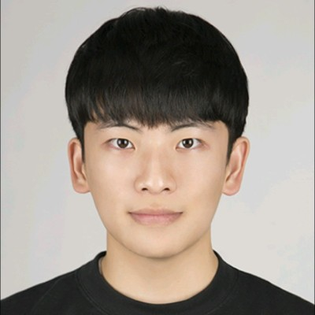

# **EfficientMusicGen Challenge @ NeurIPS 2026**{:.accent}

> December 11 or 12 @ Sydney, Australia\\
> Contact: <efficientmusicgen@gmail.com>

---

Shortcuts

- [ℹ️ Description](#description)
- [🎯 Key Principles](#principles)
- [📜 Competition Rules](#rules)
- [⚖️ Evaluation Criteria](#evaluation)
- [🏆 Awards](#awards)
- [🧑‍💻 Resources](#resources)
- [⏰ Important Dates](#dates)
- [🚀 How to Participate](#participate)
- [❓ Frequently Asked Questions](#faq)
- [🤩 Organizers](#organizers)
- [🤝 Sponsors](#sponsors)
- [📅 Workshop Schedule](#schedule)
- [💡 Invited Speakers](#speakers)
- [🔄 Previous Iterations](#iterations)

---

## ℹ️ Description {#description}

Text-to-music generation has lowered the barrier for music production and unlocked many exciting applications for multimodal content creation. Yet, most state-of-the-art text-to-music models rely on large proprietary datasets and industrial-scale computing resources. Such data and compute barrier restricts academic researchers to finetuning pretrained black-box models rather than exploring fundamental architectural innovations and understanding the behaviors of these systems.

We propose the EfficientMusicGen Challenge for NeurIPS 2026 to catalyst methodological innovations for data and compute efficient text-to-music generation. Our challenge mandates a strict fair-play benchmark: participants must train the core generative models from scratch using a standardized dataset of 3,777 hours of CC-licensed music, and the model size may not exceed 500M parameters.

The challenge consists of two stages: All submitted systems will first be evaluated by objective metrics that measure audio fidelity and prompt adherence. The top-ranked finalists will then be evaluated by human experts in a listening test. We will provide a standardized training set, reference captions, preprocessing code, and baseline code to lower the entry barrier for the participants.

By restricting the training data and model size, the challenge shifts the focus of current text-to-music research from data and compute scale towards foundational innovations on data-efficient training and compute-efficient inference. The EfficientMusicGen challenge will advance data and compute efficient methodologies, produce open-source/open-weight foundational models, and provide reusable insights for text-to-music generation.

---

### 🎯 Key Principles {#principles}

- **Data-efficient**: All submitted models must be trained from scratch using a standardized, CC-licensed dataset derived from the MTG-Jamendo corpus (55,701 songs, 3,777 hours).
- **Compute-efficient**: All submitted models must have no more than 500M parameters.

---

### 📜 Competition Rules {#rules}

- **Data**: Participants must exclusively use the provided subset of the MTG-Jamendo dataset for all training and data augmentation.
  - The use of external music datasets or synthetic audio generated by models trained on another dataset is prohibited.
- **Core generative model**: The core generative model must have no more than 500M parameters and must be trained from scratch.
  - The core generative model is defined as the main component responsible for the mapping from the conditioned text representation (or latent tokens) to the musical representations.
  - The use of pretrained weights for the core generative models is prohibited.
- **Auxiliary components**: Participants may use publicly available checkpoints for auxiliary components. However, proprietary or non-reproducible auxiliary models are prohibited.
  - Examples of auxiliary models include:
    1. Audio tokenizers or autoencoders for neural compression
    2. Large audio language models for automated captioning/tagging for data augmentation
    3. Vocoders or audio enhancement modules for post-processing
  - Encoders used solely for feature extraction and decoders used for final waveform reconstruction are considered auxiliary models.
- **Inference**: The inference pipeline must be fully autonomous. Any form of manual editing, human annotation, or cherry-picking of the generated samples is prohibited.

---

### ⚖️ Evaluation Criteria {#evaluation}

The challenge consists of two stages:

1. All submitted systems will first be evaluated by objective metrics that measure audio fidelity and prompt adherence.
2. The top-ranked finalists will then be evaluated by human experts in a listening test.

#### Stage 1: Objective Evaluation
{:.center}

**Evaluation metrics**:

- **Fréchet audio distance (FAD) & MAUVE audio divergence (MAD)**:
  FAD and MAD measure the distributional similarity between generated audio and a reference set of real music. We will adopt the [LAION-CLAP-Music](https://github.com/LAION-AI/CLAP) model ([music_audioset_epoch_15_esc_90.14.pt](https://huggingface.co/lukewys/laion_clap/blob/main/music_audioset_epoch_15_esc_90.14.pt)). For the reference set, we will use a hidden instrumental subset of MTG-Jamendo that consists of 1,000 randomly sampled tracks.
- **CLAP score**:
  The CLAP score measures the semantic alignment between the input prompt and the generated audio, defined as the cosine similarity in the joint embedding space of the CLAP-text and CLAP-audio encoders. We will adopt the [LAION-CLAP-Music](https://github.com/LAION-AI/CLAP) checkpoint ([music_audioset_epoch_15_esc_90.14.pt](https://huggingface.co/lukewys/laion_clap/blob/main/music_audioset_epoch_15_esc_90.14.pt)) as the feature extractor.
- **Concept coverage score (CCS)**:
  CCS adopts a state-of-the-art large audio language model, Qwen3-Omni [4], as a zero-shot music judge to verify the presence of each individual musical attribute. Specifically, given a test prompt synthesized from a triplet of tags representing genre, instrument, and mood/theme respectively, the concept coverage score assesses what percentage of these target concepts can be detected from the generated audio.

**Score aggregation**:

The final ranking will be determined by the sum of Borda counts across four criteria. All the *M* submissions will first be ranked according to each criteria independently. For each criterion, the best-performing submission will receive *M* points, the second best-performing receiving *M* - 1 points, ..., the worst-performing submission receiving 1 point.

**Example test prompts**:

- **Tags**: rock, electric guitar, energetic\\
  **Caption**: "An energetic rock track driven by a bold electric guitar, pulsing with intensity and raw power."
- **Tags**: jazz, piano, mellow\\
  **Caption**: "A mellow jazz piece featuring soothing piano melodies, calm and relaxed in tone."
- **Tags**: electronic, synthesizer, atmospheric\\
  **Caption**: "A smooth, atmospheric electronic track driven by rich synthesizer layers, creating a serene and immersive soundscape."

**Submission format**:

30-sec WAV files, 16 bit, 44.1 kHz, stereo

#### Stage 2: Human Evaluation
{:.center}

**Static evaluation**:

The participants will be provided with a list of 100 prompts, and they need to generate and upload the corresponding audio within a (tentatively) 72-hour window. The generated music will then be evaluated by trained human judges on a 5-point Likert scale in terms of the following criteria:

- **Audio fidelity**:
  Evaluates the technical production quality, signal clarity, and the absence of perceptible digital artifacts or distortion.
- **Prompt adherence**:
  Assesses how accurately the generated musical elements, such as instrumentation and genre, correspond to the attributes requested in the text prompt.
- **Musicality**:
  Measures intrinsic musical quality, including rhythmic stability, harmonic coherence, structural development, and general listenability.
- **Overall**:
  Captures the holistic impression of the generated music by integrating production quality, prompt relevance, and musical appeal into a single overall judgment.

We will recruit the trained human judges through our professional networks. Candidate judges include experts with years of musical training and college students in music programs.

**Live evaluation** (optional participation):

The participants may opt in for a live evaluation. The judges will be able to enter their own prompts, and the outputs will be generated on the fly. This will allow the judges to freely examine the usability and limitations of each candidate system.

The evaluation platform will be based on the [Music Arena](https://music-arena.org/) framework. The participants will need to package their submitted models into a unified [Docker-based serving format](https://github.com/gclef-cmu/music-arena\#adding-a-new-model). Participation in this live evaluation will be optional. Additional awards are available for the live evaluation winners.

---

### 🏆 Awards (*Tentative*) {#awards}

#### Static Evaluation
{:.center}

|:--------------:|:----------:|
| 🥇First Prize  | USD $1,500 |
| 🥈Second Prize | USD $1,000 |
| 🥉Third Prize  | USD $500   |

#### Live Evaluation
{:.center}

|:--------------:|:----------:|
| 🥇First Prize  | USD $1,000 |
| 🥈Second Prize | USD $500   |

---

### 🧑‍💻 Resources {#resources}

#### Data
{:.center}

**Source Dataset**:

You must train the core generative models using the [MTG-Jamendo](https://mtg.github.io/mtg-jamendo-dataset/) dataset.

1. Visit <https://github.com/MTG/mtg-jamendo-dataset>
2. Follow the README instructions
3. Download the full 3,777-hour dataset or the 457-hours subset (`raw_30s`)

The challenge consider only instrumental music. You may use any vocal removal or source separation model. You may also use the preprocessing code provided below.

**Reference caption sets**:

Two reference captions sets are provided. You may extend them using MTG-Jamendo tags, other annotations, and LLM-based data augmentation approaches. The caption generation pipeline is provided below.

Link: TBA

#### Code
{:.center}

**Vocal removal**:

Code for removing sining voices from the source dataset.

Link: TBA

**Caption generation**:

Code for generating the reference captions.

Link: TBA

**Baseline model**:

Code for a FluxAudio-based baseline model.

Link: TBA

---

### ⏰ Important Dates (*Tentative*) {#dates}

|-|-|
| July 6            | Release of standardized dataset, preprocessing and baseline code |
| August 31         | Leaderboard open                                                 |
| **September 21**  | **Registration deadline**                                        |
| September 30      | Test prompts released                                            |
| **October 2**     | **Stage I audio submission deadline**{:.accent2}                 |
| October 9         | Announcement of finalists                                        |
| **October 23**    | **Stage II model submission deadline**{:.accent2}                |
| November 6        | Announcement of winners                                          |
| December 11 or 12 | Workshop at NeurIPS 2026                                         |

---

### 🚀 How to Participate {#participate}

1. (**Registration**) To participate in the EfficientMusicGen challenge, you must register by **September 21**. After registration, you will be provided a passphrase to access the public leaderboard and submit entries.
2. (**Stage I**) For the first stage, you will be provided with a list of test prompts on September 30. You will have 72 hours to run your generation pipeline and submit the generated audio by **October 2**. Finalists who enter the second stage will be announced on October 9.
3. (**Stage II**) If you opt in for the live evaluation, you will need to convert their models into a [docker-based serving format](https://github.com/gclef-cmu/music-arena\#adding-a-new-model) compatible with the Music Arena platform by **October 23**. The final winners will be announced on November 6.

**Register link**: TBA

---

## ❓ Frequently Asked Questions {#faq}

TBA

---

## 🤩 Organizers {#organizers}

  
  

  **[Hao-Wen (Herman) Dong](https://hermandong.com/)** is an Assistant Professor in the Department of Performing Arts Technology at the University of Michigan. He is also affiliated with the Computer Science and Engineering and the Electrical and Computer Engineering departments. Herman’s research aims at augmenting human creativity with generative AI. He develops human-centered generative AI technology that can be integrated into professional creative workflows, with a focus on music, audio, and video creation. His long-term goal is to make professional content creation accessible to everyone. Herman received his PhD degree in Computer Science from the University of California San Diego, where he worked with Julian McAuley and Taylor Berg-Kirkpatrick. His research has been recognized by the AAAI New Faculty Highlights, UCSD CSE Doctoral Award for Excellence in Research, KAUST Rising Stars in AI, UChicago and UCSD Rising Stars in Data Science, ICASSP Rising Stars in Signal Processing, and UCSD GPSA Interdisciplinary Research Award.
  

  
  

  **[Yi-Hsuan Yang](https://affige.github.io/)** is a Full Professor at National Taiwan University (NTU). His research focuses on generative models for music, leading to the development of models like MidiNet, MuseGAN, and Pop Music Transformer. He is a Senior Member of IEEE and a former Associate Editor for IEEE Transactions on Multimedia and IEEE Transactions on Affective Computing.
  

  
  

  **[Chris Donahue](https://chrisdonahue.com/)** is the Dannenberg Assistant Professor in the Computer Science Department (CSD) at Carnegie Mellon University, and a part-time Research Scientist at Google DeepMind. At CMU, Chris leads the Generative Creativity Lab (G-CLef), with a mission to empower and enrich human creativity and productivity with generative AI. This primarily involves work at the intersection of music and AI, though also includes work on other applications such as code, gaming, and language. Chris’s research has also translated to real-world impact in music, from integration into performances by professional bands (The Flaming Lips) to consumer music AI tools (Beat Sage, Hookpad Aria) that have been used hundreds of thousands of times. Before CMU, Chris was a postdoctoral scholar in the CS department at Stanford advised by Percy Liang. Chris holds a PhD from UC San Diego where he was jointly advised by Miller Puckette (music) and Julian McAuley (CS).
  

  
  

  **[J. Stephen Downie](https://ischool.illinois.edu/people/j-stephen-downie)** is executive associate dean and a professor in the School of Information Sciences, and the Illinois co-director of the HathiTrust Research Center. He has been an active participant in the digital libraries and digital humanities research domains. He is best known for helping to establish a vibrant music information retrieval research community. Since 2005, he has directed the annual Music Information Retrieval Evaluation eXchange (MIREX). He also was a founder of the International Society Music Information Retrieval (ISMIR) and its first president.
  

  
  

  **[Wei-Jaw (Lonian) Lee](https://lonian6.github.io/)** is a PhD student in the Graduate Institute of Communication Engineering at National Taiwan University. His research focuses on controllable music generation, efficient generative modeling, and AI-as-a-judge frameworks for evaluating the quality and reliability of generative music systems.
  

  
  

  **[Junyoung Koh](https://junst.github.io/)** is a Ph.D. student in the Department of Artificial Intelligence at Yonsei University, and a research intern at Krafton. His research focuses on music audio understanding and generation, including music source separation, vocal multi-pitch estimation, music question answering, and text-to-music generation. He is a recipient of the Ph.D. Research Fellowship from the National Research Foundation of Korea. Junyoung also leads MAAP, a music AI research community, where he mentors students and coordinates collaborative research projects.
  

  
  

  **[Yiting Xia](https://www.linkedin.com/in/yiting-xia-47326324a/)** is a PhD student in Informatics at the School of Information Sciences, University of Illinois Urbana-Champaign. Her research focuses on AI music evaluation, with particular interest in measurement design, human evaluation, and statistical methods to understand the quality and reliability of music generation systems.
  

  
  

  **[Yonghyun Kim](https://yonghyunk1m.notion.site/)** is a PhD student in Music Technology at the Georgia Institute of Technology. Yonghyun holds an MS in Culture Technology from KAIST and a dual BS in Computer Science and Electrical Engineering from UNIST. Yonghyun investigates the intersection of AI and Music, aiming to leverage technology not just to generate media but to amplify human agency. His research focuses on designing human-centered systems with a twofold mission: (1) building intelligent assistants that lower technical barriers for musical learning, and (2) developing ``Rational AI Artists,'' steerable, interpretable agents capable of structural reasoning and transparent collaboration. By fusing multimodal perception that understands the physical reality of performance with human-aligned evaluation that captures subjective preference, he aims to bridge the gap between abstract human intent and algorithmic execution.
  

---

## 🤝 Sponsors {#sponsors}

Please drop a message to <efficientmusicgen@gmail.com> if you are interested in sponsoring the EfficientMusicGen Challenge.

---

## 📅 Workshop Schedule (*Tentative*) {#schedule}

|:-:|--|
| 1:00 - 1:15 | **Opening Remarks**                   |
| 1:15 - 2:00 | **Invited Talk**                      |
| 2:00 - 2:15 | **Award Ceremony**                    |
| 2:15 - 3:00 | **Oral Presentations by the Winners** |
| 3:00 - 4:00 | ☕Coffee Break + **Poster Session**   |
| 4:00 - 4:45 | **Invited Talk**                      |
| 4:45 - 5:00 | **Closing Remarks**                   |

---

## 💡 Invited Speakers {#speakers}

TBA

---

## 🔄 Previous Iterations {#iterations}

- [ICME 2026](https://ntu-musicailab.github.io/ICME26-ATTM-Grand-Challenge/)
